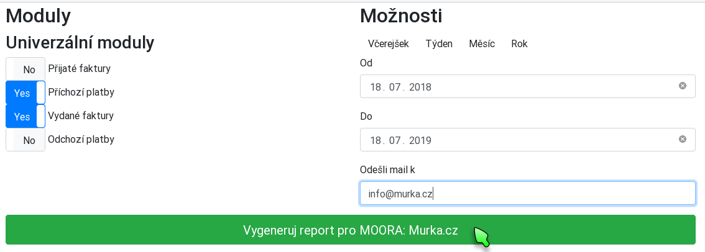

Přehled vztahu s klientem pro FlexiBee
======================================

Použití
-------

Do Adresáře FlexiBee přidá tlačítko "Přehled vztahu" kterým se aplikace volá.

Nejprve je třeba zvolit jaké moduly budou při generování vztahu použity a za
jaký časový úsek se budou data zpracovávat.

Po odeslání tlačítkem "Vygeneruj report" je tento vygenerován a zobrazen. 
Současně je tento i odeslán mailem na uvedenou adresu klienta.

Instalace
---------

V browseru je třeba ručně otevřít stránku [install.php](src/install.php)

Do formuláře se vyplní přístupové údaje do FlexiBee. 
Pokud jsou tyto správné, vytvoří se ve FlexiBee v evidenci adresáře spouštěcí tlačítko.

Testování
---------

Pokud není stránka volána s parametry $authSessionId && $companyUrl pokusí se načíst konfigurák ../testing/client.json
